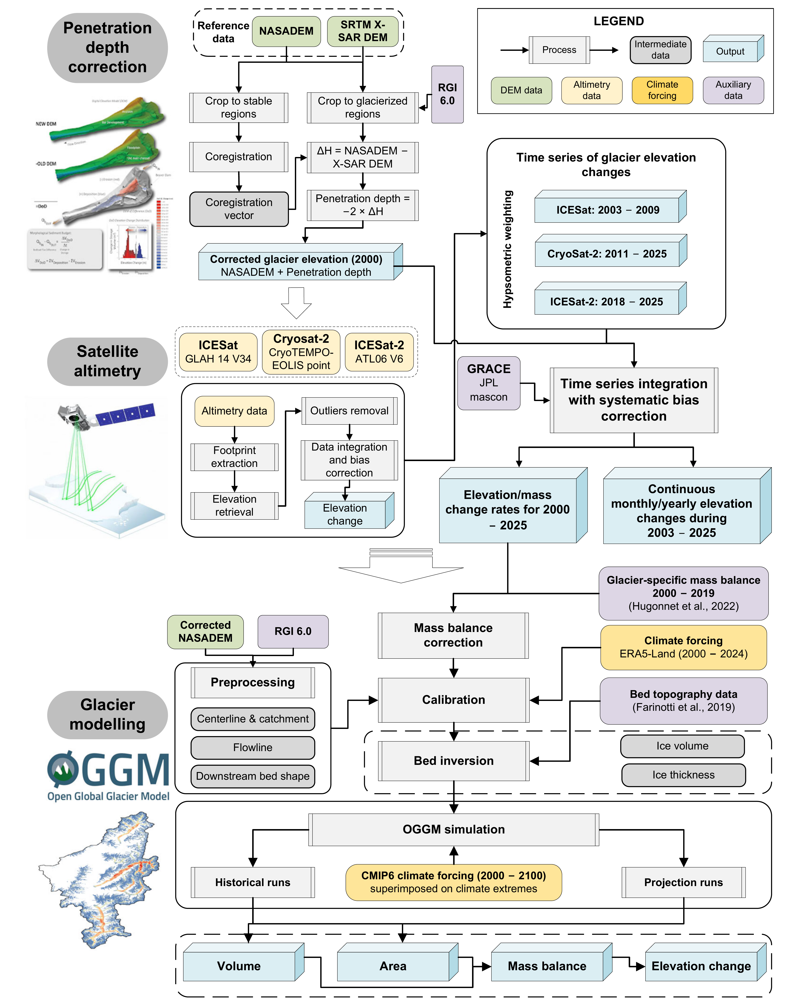

# Intensifying Climate Extremes Drive Accelerated High Mountain Asia Glacier Loss

[](LICENSE)
[](https://www.python.org/)
[](https://www.mathworks.com/)

> This repo includes code for the paper *Intensifying Climate Extremes Drive Accelerated High Mountain Asia Glacier Loss*.
>
> Multi-platform satellite altimetry (ICESat, ICESat-2, CryoSat-2) for historical trends (2003–2025), ERA5-Land climate extreme assessment, and OGGM glacier modeling for future projections under CMIP6 scenarios.

---

## Workflow Overview



---

## Table of Contents

- [Workflow Overview](#workflow-overview)
- [Repository Structure](#repository-structure)
- [Data Availability](#data-availability)
- [Installation & Environment Setup](#installation--environment-setup)
- [Workflow & Reproduction Guide](#workflow--reproduction-guide)
- [Pipeline Documentation](#pipeline-documentation)
- [Code Reference](#code-reference)

---

## Repository Structure

```
./
├── ICESat_pipeline/           # ICESat laser altimetry processing (2003–2009)
│   ├── Calculation_code/      # MATLAB processing scripts
│   └── *.ipynb                # Visualization notebook
│
├── ICESat2_pipeline/          # ICESat-2 photon counting (2018–2025)
│   ├── Calculation_code/      # MATLAB processing scripts
│   └── *.ipynb                # Visualization & NASADEM correction notebooks
│
├── CryoSat2_pipeline/         # CryoSat-2 radar altimetry (2010–2025)
│   ├── Calculation_code/      # MATLAB processing scripts
│   └── *.ipynb                # Visualization notebook
│
├── ERA5-Land_pipeline/        # Climate data extraction & extreme analysis
│   ├── ERA5-Land_export/      # Google Earth Engine export scripts
│   ├── ERA5-Land_extract/     # Glacier-level extraction & aggregation
│   └── figures/               # Visualization & figure generation scripts
│
├── Altimetry integration/     # Multi-mission data fusion & bias correction
│   └── *.ipynb                # Integration notebook
│
└── OGGM model/                # Glacier modeling & future projections
    ├── preparation/           # Altimetry-model calibration
    ├── modelling/             # CMIP6 scenario runs (4 SSPs × 13 GCMs)
    └── visualization/         # Model validation & extreme analysis
```

---

## Data Availability

### Input Data Sources

| Dataset | Source | Link | Used For |
|---------|--------|------|----------|
| ICESat GLAH14 V34 | NASA Earthdata | [earthdata.nasa.gov](https://search.earthdata.nasa.gov/) | Altimetry 2003–2009 |
| ICESat-2 ATL06 V6 | NASA Earthdata | [earthdata.nasa.gov](https://search.earthdata.nasa.gov/) | Altimetry 2018–2025 |
| CryoSat-2 CryoTEMPO | ESA | [science-pds.cryosat.esa.int](https://science-pds.cryosat.esa.int/) | Altimetry 2010–2025 |
| NASADEM | NASA EOSDIS | [doi.org/10.5067/MEaSUREs/NASADEM](https://doi.org/10.5067/MEaSUREs/NASADEM/NASADEM_HGT.001) | Reference DEM (2000) |
| SRTM X-SAR | DLR | [eoweb.dlr.de](https://eoweb.dlr.de/) | Penetration correction |
| RGI v6.0 | GLIMS | [glims.org/RGI](http://www.glims.org/RGI/randolph60.html) | Glacier boundaries |
| HMA Subregions | MountCryo | [mountcryo.org](https://www.mountcryo.org/download/subdivision-of-high-mountain-asia/) | Regional division |
| ERA5-Land | Google Earth Engine | [developers.google.com](https://developers.google.com/earth-engine/datasets/catalog/ECMWF_ERA5_LAND_DAILY_AGGR) | Climate forcing |
| GRACE/GRACE-FO | JPL | [grace.jpl.nasa.gov](http://grace.jpl.nasa.gov) | TWS gap-bridging |
| CMIP6 | ESGF | [esgf-node.llnl.gov](https://esgf-node.llnl.gov/) | Future projections |

### Processed Data Products

Processed intermediate data products are available on Zenodo:

[](https://zenodo.org/records/18365763)

### Data Directory Structure

Data paths are managed through **centralized configuration files** in each pipeline. Users should modify these configuration files to match their local data locations.

**Configuration locations** (adapt paths to your environment):

| Pipeline | Configuration File |
|----------|-------------------|
| ERA5-Land | `ERA5-Land_pipeline/config.json` |
| ICESat | `ICESat_pipeline/Calculation_code/functions/load_icesat_config.m` |
| ICESat-2 | `ICESat2_pipeline/Calculation_code/functions/load_processing_config.m` |
| CryoSat-2 | `CryoSat2_pipeline/Calculation_code/functions/load_cryosat2_config.m` |
| OGGM | Script header variables (relative paths) |

**Expected data structure:**

```
{DATA_ROOT}/
├── era5_land/
│   ├── raw/                    # ERA5-Land GeoTIFF exports
│   └── extracted/              # Processed zarr/xlsx outputs
├── glacier_boundary/
│   └── rgi_hma/                # RGI glacier shapefiles
├── regional_boundary/
│   ├── hma/                    # HMA boundary shapefile
│   └── subregions/             # Subregion boundaries
├── altimetry_results/
│   ├── icesat/                 # ICESat processing outputs
│   ├── icesat2/                # ICESat-2 processing outputs
│   └── cryosat2/               # CryoSat-2 processing outputs
├── dem/
│   └── nasadem/                # NASADEM tiles
└── cmip6/                      # CMIP6 climate model outputs
```

**For Jupyter notebooks:** Most notebooks define paths in early cells. Search for path variables and update to match your data location.

---

## Installation & Environment Setup

### Prerequisites

- **Docker** and **VS Code** with [Dev Containers extension](https://marketplace.visualstudio.com/items?itemName=ms-vscode-remote.remote-containers)
- **MATLAB** R2020b+ for altimetry processing <!-- TODO: List required MATLAB toolboxes -->
- **Google Earth Engine** account (for ERA5-Land export)
- **Storage**: ~10 TB disk space for data <!-- TODO: Estimate storage requirements -->

### Dev Container Setup (Recommended)

We recommend using [Development Containers](https://containers.dev/) (Dev Containers) for a reproducible environment with all dependencies pre-configured. Dev Containers run inside Docker and ensure consistent behavior across different machines. We provide a pre-built Docker image (`luoqili/oggm:latest`) containing all required dependencies.

**Requirements:**
- [Docker Desktop](https://www.docker.com/products/docker-desktop/) (Windows/macOS) or [Docker Engine](https://docs.docker.com/engine/install/) (Linux)
- [Visual Studio Code](https://code.visualstudio.com/) with the [Dev Containers extension](https://marketplace.visualstudio.com/items?itemName=ms-vscode-remote.remote-containers)

**Setup Steps:**

1. Clone the repository:
   ```bash
   git clone https://github.com/Liluoq/intensifying-climate-extremes-drive-accelerated-high-mountain-asia-glacier-loss.git
   ```

2. Create a `.devcontainer/devcontainer.json` file with the following content:
   ```json
   {
     "name": "HMA Glacier Analysis",
     "image": "luoqili/oggm:latest",
     "mounts": [
       "source=/path/to/your/data,target=/data,type=bind"
     ],
     "customizations": {
       "vscode": {
         "extensions": ["ms-python.python", "ms-toolsai.jupyter"]
       }
     }
   }
   ```
   Update the `source` path in `mounts` to point to your local data directory.

3. Open the repository folder in VS Code. When prompted, select **"Reopen in Container"**, or use the Command Palette (`Ctrl+Shift+P` / `Cmd+Shift+P`) and run **"Dev Containers: Reopen in Container"**.

For comprehensive guidance, see the official documentation:
- [Developing inside a Container (VS Code)](https://code.visualstudio.com/docs/devcontainers/containers)
- [Dev Container specification](https://containers.dev/)
- [Advanced container configuration](https://code.visualstudio.com/remote/advancedcontainers/overview)

**Pre-configured Environment:**

The `luoqili/oggm:latest` Docker image includes all required dependencies:
- **Python 3.11** with conda package manager
- **Geospatial stack**: GDAL 3.5+, GeoPandas, Cartopy 0.22+, rasterio, Shapely
- **Scientific computing**: NumPy, pandas, xarray, netCDF4, dask, zarr
- **Statistical analysis**: statsmodels, scikit-learn, pwlf, hampel
- **Visualization**: Matplotlib, seaborn
- **OGGM**: Modified Open Global Glacier Model v1.5.4 (included in `OGGM model/modelling/oggm/`)
- **Jupyter**: JupyterLab or Jupyter Notebook server

### Verification

After the container starts, verify the environment:

```bash
python -c "import geopandas, cartopy, xarray, oggm; print('Environment OK')"
```

To test Jupyter notebook functionality:
```bash
jupyter notebook --version
```

---

## Workflow & Reproduction Guide

### Step-by-Step Reproduction

**Step 1: Data Acquisition**

- See the paper's **Methods** and **Data Availability** sections for detailed data acquisition instructions. A summary of input data sources and links is provided in the [Data Availability](#data-availability) section above.

**Step 2: Altimetry Processing (MATLAB)**
- Run three pipelines: `ICESat_Main_Processing_Pipeline.m` (2003–2009), `ICESat2_Main_Processing_Pipeline.m` (2018–2025), `CryoSat2_Main_Processing_Pipeline.m` (2010–2025)
- Each pipeline has 4 stages: (1) Extract tracks from HDF5/NetCDF with spatial filtering and glacier masking, (2) Enhance with NASADEM terrain, slope, and penetration depth corrections, (3) Compute statistics with robust two-stage filtering and area-weighted aggregation across subregions and grid cells, (4) Export to Excel

**Step 3: Climate Data Extraction (Python)**
- Run `ERA5-Land_export.ipynb` to export 10 climate variables (temperature, precipitation, radiation, etc.) from Google Earth Engine as daily GeoTIFFs
- Run `extract_main.py` for parallel extraction of glacier-level mean statistics using exactextract library, storing results in a 3D Zarr array (glaciers × variables × time)
- Run `aggregate_to_monthly.py` to convert daily data to monthly means
- Run `calculate_extreme_scores.py` to assess climate extremes using percentile thresholds and output annual compound scores

**Step 4: Altimetry Integration (Python)**
- Run `HMA_Altimetry_Integration.ipynb` to load seasonal/yearly elevation changes from ICESat (2003–2009), CryoSat-2 (2010–2025), and ICESat-2 (2018–2025)
- Apply region-specific systematic bias corrections from calibration matrix, then concatenate into continuous 2003–2025 time series
- Apply Hampel filtering for outlier removal and Robust Linear Regression (RLM with Huber M-estimator) to compute elevation change trends (dh/dt) with p-values and confidence intervals
- Convert to mass balance (Gt/yr) using glacier areas and density, propagating uncertainties from elevation, area, and density sources

**Step 5: OGGM Modeling (Python)**
- Run `OGGM_ts1000-v2.py` to calibrate `mu_star` (temperature sensitivity parameter) using geodetic mass balance from altimetry
- Process ERA5-Land monthly climate data and run historical simulations (1950–2025) with dynamic spinup from 1979
- Run CMIP6 projections (2025–2100) for 13 GCMs × 4 SSPs (ssp126/245/370/585), including extreme scenarios using Quantile Delta Mapping (QDM) and Detrend Quantile Mapping methods
- Validate against altimetry observations using multiple metrics in `OGGM_Climate_Extreme_Visualization_v2.ipynb`

*Note: Figures are generated within the notebooks of each step.*

---

## Pipeline Documentation

### ICESat Pipeline (2003–2009)

**Location**: `ICESat_pipeline/Calculation_code/`

ICESat (Ice, Cloud, and land Elevation Satellite) provides laser altimetry measurements for glacier elevation change analysis. 

**Stages**:
1. **Extract** (`extract_icesat_tracks.m`): Extract from GLAS/ICESat L2 (GLA14) HDF5 files, apply spatial boundary clipping to HMA region, assign glacier flags and region identifiers → 14-column TXT output
2. **Enhance** (`enhance_icesat_data.m`): Add terrain parameters using 3×3 NASADEM neighborhood averaging, calculate WGS84 ellipsoidal heights, compute elevation changes (dh), add regional identifiers → 24-column TXT output
3. **Statistics** (`compute_icesat_statistics.m`): Multi-scale statistical analysis (annual, 3-year windows, campaign-based) across multiple region hierarchies (HMA4, HMA22, GTN/RGI15, Grid496), with two-step quality filtering
4. **Visualize** (`ICESat_Visualization_Notebook.ipynb`): Time series plots and spatial mapping using Python

**Input**: GLAS GLA14 v34 HDF5 files (2003–2009, 19 campaigns)  
**Output**: Excel files with dh/dt per region (annual, seasonal, elevation bands) + MAT files with structured results

### ICESat-2 Pipeline (2018–2025)

**Location**: `ICESat2_pipeline/Calculation_code/`

ICESat-2 provides laser altimetry with higher spatial resolution (~17m footprint) and 6 simultaneous ground tracks per orbit. The mission offers continuous 91-day repeat cycle coverage, enabling monthly time series analysis.

**Stages**:
1. **Extract** (`extract_icesat2_tracks.m`): Extract from ATL06 v006 HDF5 files (6 ground tracks: gt1l/r, gt2l/r, gt3l/r), apply glacier masking, assign region identifiers → 13-column CSV output
2. **Enhance** (`enhance_icesat2_data.m`): Add terrain parameters from NASADEM, calculate WGS84 heights, apply penetration depth correction (grid-based lookup), compute final elevation changes → 20-column TXT output
3. **Statistics** (`compute_icesat2_statistics.m`): Multi-temporal analysis (monthly, seasonal, annual, multi-year), multi-spatial analysis (39 regions + 496 grid cells), elevation band analysis, area-weighted computations with robust linear fitting
4. **Visualize** (`ICESat2_Visualization_Notebook.ipynb`): STL decomposition, anomaly detection, grid-scale analysis

**Input**: ICESat-2 ATL06 v006 HDF5 files (2018-present, continuous)  
**Output**: Excel files, elevation band results per region, MAT files with full analysis structures

### CryoSat-2 Pipeline (2010–2025)

**Location**: `CryoSat2_pipeline/Calculation_code/`

CryoSat-2 provides radar altimetry with a larger footprint (~300m) and 369-day repeat cycle. The pipeline is adapted for radar-specific characteristics including larger spatial averaging requirements.

**Stages**:
1. **Extract** (`extract_cryosat2_tracks.m`): Extract from CryoTEMPO SWATH POINT NetCDF files, apply spatial filtering, assign region identifiers → 13-column TXT output
2. **Enhance** (`enhance_cryosat2_data.m`): uses 11×11 NASADEM neighborhood averaging (121 pixels) to match ~300m radar footprint, calculate elevation changes → 16-column TXT output
3. **Statistics** (`compute_cryosat2_statistics.m`): Annual, multi-year (3-year windows), monthly (152 months), grid-based (496 cells), elevation band analysis with two-stage robust filtering
4. **Visualize** (`CryoSat2_Visualization_Notebook.ipynb`): Time series and spatial analysis

**Input**: CryoTEMPO L2I NetCDF files (2010-present)  
**Output**: Excel files (seasonal/yearly), elevation band results, MAT files with analysis structures

### ERA5-Land Pipeline

**Location**: `ERA5-Land_pipeline/`

Extracts and processes ECMWF ERA5-Land reanalysis data for glacier-specific climate analysis, enabling assessment of climate extremes affecting HMA glaciers.

**Phases**:
1. **Export** (`ERA5-Land_export/`): Google Earth Engine exports ECMWF/ERA5_LAND/DAILY_AGGR data to GeoTIFF (10 bands per file, 0.1° resolution)
2. **Extract** (`ERA5-Land_extract/extract_main.py`): Parallel raster-vector extraction using exactextract library, glacier polygon means → Zarr store (3D: glacier × variable × time)
3. **Aggregate** (`aggregate_to_monthly.py`): Daily → Monthly means with NaN handling and quality logging
4. **Score** (`calculate_extreme_scores.py`): Per-glacier percentile-based extreme scoring for temperature (hot) and precipitation (dry) conditions

**Output**: `glacier_stats.zarr` (daily), `glacier_stats_monthly.xlsx` (10 sheets), `glacier_extreme_scores.xlsx` (annual scores)

### OGGM Glacier Modeling

**Location**: `OGGM model/`

Implements the Open Global Glacier Model (OGGM) framework for glacier dynamics simulation, calibrated against altimetry observations and driven by ERA5-Land historical data and CMIP6 future projections.

**Directory Structure**:
- `preparation/`: Altimetry-based calibration of Hugonnet et al. (2021) mass balance data
- `modelling/`: Main OGGM execution scripts and climate processing
- `visualization/`: Results analysis and figure generation

**Calibration Approach (Hugonnet MB)**:
- Input: Hugonnet et al. (2021) per-glacier mass balance dataset
- Method: Regional scaling factors computed by comparing DEM-differencing with ICESat/ICESat-2/CryoSat-2 observations
- Output: Calibrated mass balance for OGGM mu-star parameter tuning

**Climate Forcing**:
- Historical: ERA5-Land monthly data (1950–2025) for temperature and precipitation
- Future: CMIP6 projections (2025–2100)
- Scenarios: SSP126, SSP245, SSP370, SSP585
- GCMs (13 models): BCC-CSM2-MR, CAMS-CSM1-0, CESM2, CESM2-WACCM, EC-Earth3, EC-Earth3-Veg, FGOALS-f3-L, GFDL-ESM4, INM-CM4-8, INM-CM5-0, MPI-ESM1-2-HR, MRI-ESM2-0, NorESM2-MM

**Key Notes**:
- **QDM (Quantile Delta Mapping)**: Bias correction preserving climate change signals while matching ERA5-Land extreme distributions
- **Dynamic spinup**: From 1979 to minimize area discrepancy with observed glacier extents
- **Multiple simulation variants**: Normal CMIP6, QDM-corrected extremes, Detrend-QM extremes
- **Batch processing**: Supports parallel computation across glacier subsets

**Output**: Per-glacier NetCDF diagnostics (`model_diagnostics_*.nc`, `model_geometry_*.nc`), compiled regional results (`run_output_cmip6_*.nc`)

---

## Code Reference

### ICESat_pipeline/

- `ICESat_Visualization_Notebook.ipynb` — Visualizes ICESat laser altimetry data for glacier elevation changes across HMA, computing gridded (1°) elevation change trends using robust linear regression with Hampel filtering and generating publication-quality bubble maps.
- **Calculation_code/**
  - `ICESat_Main_Processing_Pipeline.m` — Main MATLAB pipeline processing ICESat data (2003–2009) through four stages: track extraction, NASADEM enhancement with 3×3 averaging, multi-scale statistical analysis, and Excel export.
  - `Processing_Documentation.m` — Comprehensive documentation of the ICESat processing workflow including data formats, quality control strategies, and troubleshooting.
  - **functions/**
    - `extract_icesat_tracks.m` — Extracts elevation and position data from GLAH14 HDF5 files, classifies glacier/non-glacier points, and assigns spatial region identifiers.
    - `enhance_icesat_data.m` — Adds terrain parameters (NASADEM elevation, slope, aspect), computes WGS84-corrected elevations and elevation changes with PDD corrections.
    - `compute_icesat_statistics.m` — Performs multi-scale statistical analysis (annual, 3-year windows, campaigns) with quality filtering and area-weighted aggregation.
    - `load_icesat_config.m` — Initializes configuration structure with file paths, quality thresholds, and processing options.
    - `utils.m` — Utility functions for colormap generation, robust mean calculation, and median-based anomaly filtering.

### ICESat2_pipeline/

- `ICESat2_Visualization_Notebook.ipynb` — Comprehensive visualization including time series analysis, gridded spatial distribution at 1° resolution, STL decomposition, and elevation band analysis.
- `NASADEM_correction.ipynb` — Calculates penetration depth corrections by computing elevation-binned penetration depths and performing Nuth & Kääb coregistration between NASADEM and ICESat-2.
- **Calculation_code/**
  - `ICESat2_Main_Processing_Pipeline.m` — Orchestrates ICESat-2 processing including raw data extraction, topographic and penetration corrections, and multi-scale statistical analysis.
  - `Processing_Documentation.m` — Technical documentation covering data formats, quality control, penetration depth corrections, and result interpretation.
  - **functions/**
    - `extract_icesat2_tracks.m` — Extracts ATL06 track data from HDF5 files (6 ground tracks), applies glacier masking, and assigns region/grid identifiers.
    - `extract_nonrgi_icesat2_tracks.m` — Extracts ATL06 data outside RGI glacier boundaries, saves non-glacier footprints to CSV files organized by grid cells.
    - `enhance_icesat2_data.m` — Adds terrain information from NASADEM, applies penetration depth correction, computes corrected elevation changes with quality filtering.
    - `compute_icesat2_statistics.m` — Computes statistics across temporal (monthly, seasonal, annual), spatial (grid, regional), and elevation band domains with area-weighting.
    - `load_processing_config.m` — Loads and validates configuration parameters including paths, thresholds, and processing options.
    - `generate_processing_report.m` — Generates comprehensive text report documenting parameters, quality statistics, and analysis results.
    - `utils.m` — Utility functions for colormap creation, outlier removal, robust statistics, and date conversion.

### CryoSat2_pipeline/

- `CryoSat2_Visualization_Notebook.ipynb` — Computes gridded elevation change trends using Hampel filtering and robust regression, generates bubble maps for multiple time periods (2010–2025).
- **Calculation_code/**
  - `CryoSat2_Main_Processing_Pipeline.m` — Orchestrates CryoSat-2 radar altimetry processing through extraction, 11×11 NASADEM enhancement, and multi-scale statistical analysis.
  - `Processing_Documentation.m` — Technical documentation emphasizing 11×11 neighborhood averaging for NASADEM integration and quality control strategies.
  - **functions/**
    - `extract_cryosat2_tracks.m` — Extracts satellite altimetry data from CryoTEMPO NetCDF files, performs spatial filtering, assigns region identifiers.
    - `extract_nonrgi_cryosat2_tracks.m` — Extracts data from non-RGI glacier regions, saves to 1° grid cell CSV files with 8 columns.
    - `enhance_cryosat2_data.m` — Adds terrain information with 11×11 NASADEM averaging (121 pixels for ~300m footprint), computes elevation changes after geoid correction.
    - `compute_cryosat2_statistics.m` — Performs statistical analysis including annual, multi-year, monthly (152 months), and gridded statistics with robust filtering.
    - `load_cryosat2_config.m` — Loads and validates configuration parameters for CryoSat-2 processing.
    - `utils.m` — Utility functions for colormap creation, robust statistics, and median-based anomaly filtering.

### ERA5-Land_pipeline/

- `config.json` — Central configuration specifying input/output paths, 10 climate variables, processing parameters (batch size, workers), and output formats.
- **ERA5-Land_export/**
  - `ERA5-Land_export.ipynb` — Exports daily ERA5-Land climate data (temperature, precipitation, radiation, evaporation, snowfall) for HMA to Google Drive via Earth Engine at 11km resolution.
- **ERA5-Land_extract/**
  - `extract_main.py` — Main orchestration script extracting ERA5-Land data from rasters to zarr array indexed by glacier ID, variable, and timestamp using parallel batch processing.
  - `extract_util.py` — Utility module for geospatial raster-vector extraction with parallel processing and multiprocess-safe logging.
  - `aggregate_to_monthly.py` — Aggregates daily glacier statistics to monthly means, exports to Excel with one sheet per climate variable.
  - `calculate_extreme_scores.py` — Calculates extreme climate scores using percentile-based thresholds for temperature (hot) and precipitation (dry), outputs annual compound metrics.
- **figures/**
  - `fig_batch1_gridded_diff.py` — Generates gridded bubble maps of temperature, precipitation, and compound extreme score differences between pre/post-2021 periods (ED_fig3a-c).
  - `fig_batch2_summary_trends.py` — Generates time series plot of HMA-wide annual compound scores and bar chart of glaciers' top-5 extreme years distribution (ED_fig3d-e).
  - `fig_batch3_distribution_by_year.py` — Generates box plot of compound extreme scores across glaciers 1990-2024, colored by median score (ED_fig3f).

### Altimetry integration/

- `HMA_Altimetry_Integration.ipynb` — Integrates elevation measurements from ICESat, ICESat-2, and CryoSat-2 (2003-2025), applies systematic bias corrections, performs STL decomposition and robust regression for trend extraction and mass balance computation.

### OGGM model/

- **preparation/**
  - `Altimetry_Model_Calibration.ipynb` — Calibrates per-glacier mass balance from Hugonnet et al. (2021) to match satellite altimetry observations, applying region-specific correction factors for HMA subregions.
- **modelling/**
  - `era5_data_to_model_input.ipynb` — Converts ERA5-Land monthly climate data (temperature, precipitation, geopotential) to flattened NetCDF files compatible with OGGM, cropped to HMA (1950–2025).
  - `OGGM_glacier_modeling_HMA_CMIP6_scenarios.ipynb` — Performs glacier mass change projections using OGGM with historical ERA5-Land simulation and CMIP6 future scenarios (4 SSPs × 13 GCMs, 2025–2100).
  - `OGGM_ts1000-v2.py` — OGGM mass balance simulations with calibration using geodetic observations, historical runs, and future projections under multiple climate scenarios.
- **visualization/**
  - `OGGM_Climate_Extreme_Visualization_v2.ipynb` — Analyzes OGGM simulation results, compares against satellite altimetry observations, assesses climate extreme impacts on glacier mass balance.
  - `oggm_utils.py` — Utility module for aggregating OGGM results to geographic regions by spatially selecting glaciers and extracting NetCDF data files.

